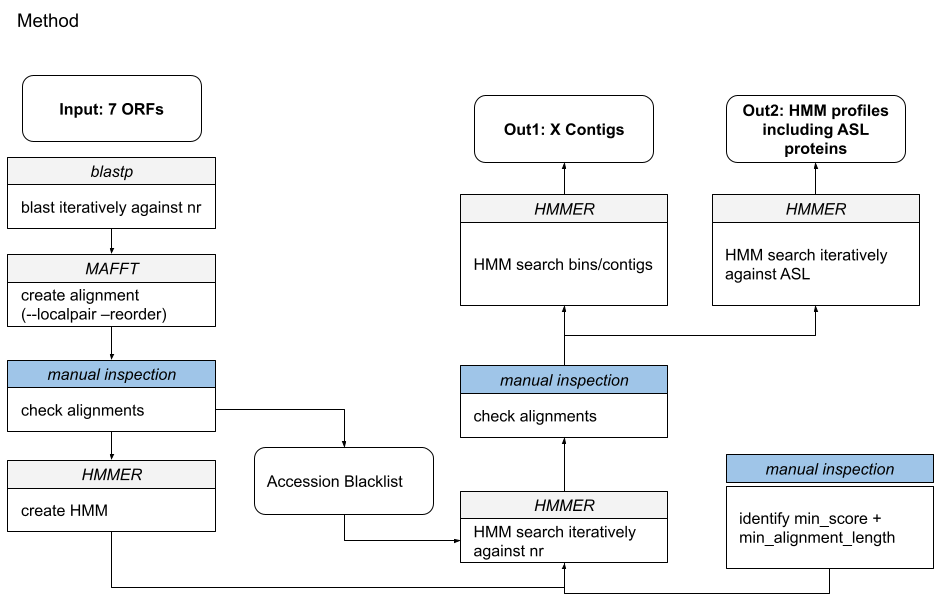

## pR1SE in Australian Salt Lakes
### Task Description Susanne Email

We will use a core set of conserved proteins for the detection of new pR1SE relatives in the Australian salt lakes and public databases?

If we identified like 30-50 (?) possible candidates, we do the follwing:
1. Are there more possible "core proteins", if yes, which ones?
2. Are these core proteins on a main chromosome or on a plasmid?
3. What replication protein are found?
4. Who is the host?
5. Phylogeny of the relatives.

### Method description
1. generate a trusted database for each conserved proteins
    1. query public databases / Australian salt lakes with the proteins and find potentially more (evalue 10^-5 and score > 50).
    2. repeat this iteratively
    3. create a HMM (MAFFT for alignment and HMMER for hmm creation)
    4. again, iteratively search ASL and public databases thus increasing the number of proteins in a cluster even more (cutoffs are dependend on a search hmm-vs-pfam)
2. then screen binned/not-binned contigs and select ones with hits >4000 bp and at least 4 (might be more for us, since for 4/4 for pleos, so we have to go higher?)
3. further downstream quality control 

Note: after 2 iterations the profiles did not return any new results.



### Notes from Tomas
- the concept is: lose addition of homologs then later on removal of short proteins and more distant proteins (see step 5, where we set the minimum score to be included equal to the maximum score of false positives + 10)
- he has some pre-sorted assemblies where the contigs are sorted into plasmid / 

### The parts of the project
#### A - generate_protein_clusters
This part is basically steps 1 (substeps 1-4) mentioned in the methods description. I'm happy with the results we have here.
Final commands to generate the files for all ORFs:
1. Generate MSAs
```commandline
for i in *; do mafft --localpair --reorder $i > ../FINAL_msa/${i}.msa; done
```
2. Generate profiles:
```commandline
for i  in *; do hmmbuild --amino ../FINAL_profiles/${i}.hmm $i; done
```

#### B - known_hosts
This is interesting. Key is: I need to figure out how to get from protein accession to genome accession. I will try once more, before moving on and asking Daan Speth.

#### C - search_ASL
This part is basically step 2 in the methods. So far not much has been done, initial search showed some hits.

#### D - search IMG
Same approach as in search_ASL. Needed to download IMGV7 and changed some "-" characters to "" using the following command:
```
sed -i.bak 's/^-//g' IMGVR_all_proteins.faa
```

#### E - check the synteny of the discovered relatives
I made a mistake in B - known_hosts, that downloads NZ_contig_ID and contig_ID as two different contigs.
This now has impacts on this part, and the protein length analysis etc. I should go back and check how to solve it. 


#### F - check the presence/absence of other pR1SE ORFs
had to copy the genes from ./E_check_synteny/genes/ since I had to replace the '*' with '' in the protein files with the following command:
`for i in *; do sed -i "s/\*//g" $i; done`


