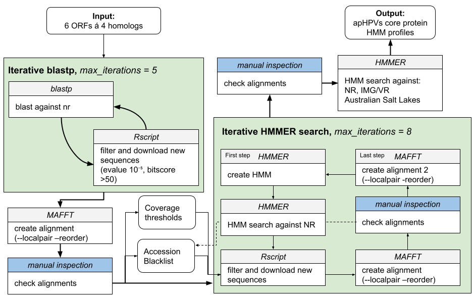

## pR1SE in Australian Salt Lakes
### Task Description Susanne Email

We will use a core set of conserved proteins for the detection of new pR1SE relatives in the Australian salt lakes and public databases?

If we identified like 30-50 (?) possible candidates, we do the follwing:
1. Are there more possible "core proteins", if yes, which ones?
2. Are these core proteins on a main chromosome or on a plasmid?
3. What replication protein are found?
4. Who is the host?
5. Phylogeny of the relatives.

### Method description
1. generate a trusted database for each conserved proteins
    1. query public databases / Australian salt lakes with the proteins and find potentially more (evalue 10^-5 and score > 50).
    2. repeat this iteratively
    3. create a HMM (MAFFT for alignment and HMMER for hmm creation)
    4. again, iteratively search ASL and public databases thus increasing the number of proteins in a cluster even more (cutoffs are dependend on a search hmm-vs-pfam)
2. then screen binned/not-binned contigs and select ones with hits >4000 bp and at least 6 (might be more for us, since for 4/4 for pleos, so we have to go higher?)
3. further downstream quality control 

Note: after 2 iterations the profiles did not return any new results.




### input for all of this
'initial_data_susanne/' contains the input for this project.

### Final Results
'plots/' contains many plots that were generated in this pipeline.
'main_figures/' contains the figures I suspect might become main figures in the publication.
'FINAL_complete_relatives/' contains the final complete pR1SE-relatives found in NCBI and ASL.
'FINAL_complete_relatives_proteins/' contains the correspponding proteins.

The main findings regarding the pR1SE relatives can be accessed here:
quick_access_pR1SE_google_sheet.R


### The parts of the project
#### A - generate_protein_clusters
Here, we find, align create hmm profiles for each ORF iteratively. 
This results in 'A_generate_protein_clusters/FINAL_profiles/ORF*.hmm'.


#### B - known_hosts
Here we use the information we got while creating the clusters in "A", to identify sequences on NCBI that have multiple pR1SE proteins.
This results in ~80 pR1SE relatives from NCBI in the folder 'B_known_hosts/known_hosts/'.

#### C - search_ASL
Here we use the profiles form A in order to search the Australian Salt Lakes for pR1SE relatives. Results in the file 'pR1SE_australian_lakes/C_search_ASL/scripts/novel_host_sequences.fasta'.


#### D - search IMG
Same approach as in search_ASL. 
Needed to download IMGV7 and changed some "-" characters to "" using the following command:
```
sed -i.bak 's/^-//g' IMGVR_all_proteins.faa
```
However, we dont find full pR1SE relatives in IMG. Makes sense, since they excluded plasmids in one of their releases. 
We will come back to this result later though!


#### E - check the synteny of the discovered relatives
Here we learn about the synteny, the two clusters etc. Gave us a first region_border idea for each pR1SE like element. 


#### F - check the presence/absence of other (non core) pR1SE ORFs in the pR1SE relatives
There are two approaches in the folder. The better is found in the subfolder all_against_all, which relies on a psi_blast clustering in order to determine the core, cloud and pangenome of pR1SE.

#### G - annotate the complete relatives
Annotate all genes of pR1SE regions with:
- DRAM
- nr
- interpro-scan

Results in 'improved_gene_df_with_DRAM_and_nr.tsv'.

Here we also search for replication, toxins, partitioning systems and other core plasmid functions.

#### H_inserted_genes
Get info on the length/number of genes between the two clusters.

#### I_host_prediction
For our metagenomic assembled pR1SEs, we do not know the host. Here we use iphop to figure this out.

#### J_COG_categories_complete
Analyzing the COG categories found in pR1SE_region genes. 
*This is out of date and not important rn*

#### K - integrases
We are looking for integrases surrounding the pR1SEs!

#### L conserved regions
This is tricky: We are looking for mutation rates along the core genes, which we do in "K". Here in L, we do it via alignments, which does not really work. 
*This is out of date and not important rn*

#### K - mutation rates
This is tricky: We are looking for mutation rates along the core genes, for that we need reads, so we do it only for the ORFs coming from our own assembled contigs.


#### Z - mini tests
Contains plenty of little things I checked. Documented inside.


